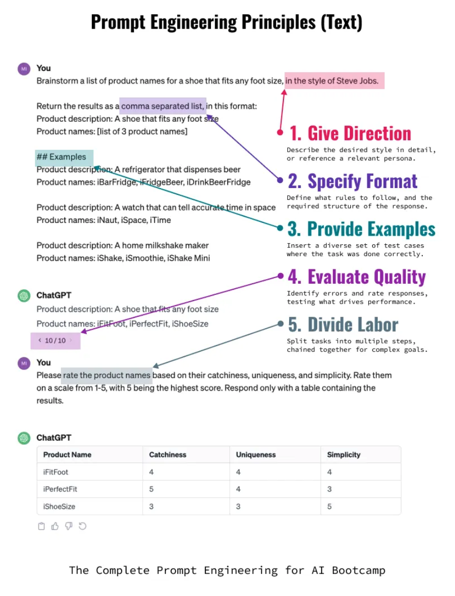
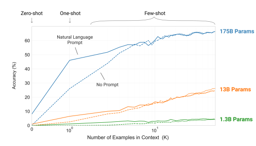

책에서는 프로덕션에서 쓰일 수 있는 프롬프트를 만들기 위해서는 5가기 원칙을 지켜야 한다고 주장한다.

1. 지시 내리기: 원하는 스타일을 설명하거나 페르소나 참조
2. 형식 정하기: 따라야 할 규칙과 응답 구조 정의
3. 예시 들기: 작업이 올바르게 수행된 테스트 사례 제공
4. 품질 평가하기: 오류를 식별하고 응답을 평가하여 성능을 높이는 요인을 테스트
5. 업무 나누기 : 여러 단계 목표로 분리

저자는 이러한 가이드는 오픈AI의 자체 프롬프트 엔지니어링 가이드와 많은 부분에서 일치하며 검증된 원칙이라 설명하며 AI를 자주 쓰는 사람이라면 이와 같은 형식으로 수렴할거라고 설명한다. (본인도 그런듯)



## 1. 지시 내리기

지시 내리기는 LLM에게 특정 역할이나 맥락을 부여하여 더 정확하고 일관된 응답을 얻는 기법이다. 대표적인 방법으로는 **롤플레잉(페르소나 부여)**과 **예열/내부검색**이 있다.

### 롤플레잉 (페르소나 부여)

AI에게 특정 전문가나 역할을 부여하면 해당 분야의 관점에서 답변하게 된다.

```
당신은 10년 경력의 시니어 백엔드 개발자입니다.
코드 리뷰를 진행할 때 성능, 보안, 유지보수성 관점에서 피드백을 제공합니다.
다음 코드를 리뷰해주세요.
```

### 예열 / 내부검색 (Priming)

AI가 답변하기 전에 관련 지식이나 맥락을 먼저 떠올리게 하여 더 정확한 응답을 유도하는 기법이다.

```
머신러닝의 과적합(overfitting) 문제에 대해 알고 있는 내용을 먼저 정리해보세요.
그 다음, 과적합을 방지하기 위한 실용적인 방법 5가지를 설명해주세요.
```

이 방식은 AI가 내부적으로 관련 지식을 활성화한 후 답변하게 만들어 품질을 높인다.

이렇게 생성된 맥락과 조언을 바탕으로 본래 작업에 대한 추가 프롬프트를 요청하는 것이다. 예를 들어 2단계로 나눠서 진행할 수 있다:

**1단계: 맥락 생성 프롬프트**

```
당신은 React와 TypeScript 전문가입니다.
대규모 프로젝트에서 상태 관리를 할 때 고려해야 할 사항들을 먼저 정리해주세요.
- 성능 관점
- 유지보수 관점
- 테스트 용이성 관점
```

**2단계: 본래 작업 프롬프트**

```
위에서 정리한 고려사항을 바탕으로,
현재 우리 프로젝트의 장바구니 기능에 적합한 상태 관리 방식을 추천해주세요.
Context API, Redux, Zustand 중 어떤 것이 적합할지 비교 분석해주세요.
```

이처럼 AI가 먼저 관련 지식을 활성화하고 정리한 후, 그 맥락 위에서 실제 문제를 해결하게 하면 더 깊이 있고 일관된 답변을 얻을 수 있다.

### 정리

이러한 전력에서는 근본적으로 지식과 상황에 대한 맥락을 우선 전달하는 것이 목표라 할 수 있다. 대신 이러한 문맥의 길이가 길어질수록 더많은 비용이 지출 될 것이고 지시사항이 너무 많거나 서로 충될되는 프롬프트를 명시할 경우, 지나치게 디테일한 프롬프트일 경우 학습 데이터가 부족하여 원하는 결과를 도출하지 못랄 수도 있다.

따라서 적당한 지점에서 트레이드 오프하여 범용성을 유지하는 프롬프트를 작성하는 것이 중요할 것 같다.(내 생각)

## 2. 형식 정하기

형식 정하기는 AI의 응답 구조를 명확하게 제어하는 기법이다. 출력 형식을 지정하면 일관되고 파싱하기 쉬운 결과를 얻을 수 있다.

특히나 동일한 프롬프트를 실행했을 때에도 여러 형식의 출력이 나타날 수 있기에 챗봇서비스가 아닌, 일반적인 서비스에서 LLM을 서비스에 통합시키려면 출력내용에 대한 직접적인 통제가 필요하다.

프론트엔드 엔지니어와 백엔드 엔지니어가 응답 형식을 미리 지정해두고 작업하듯 출력 형식을 미리 정하는 것이다.

### JSON/구조화된 데이터 출력

```
다음 제품 리뷰를 분석하고 JSON 형식으로 출력하세요:

{
  "sentiment": "positive/negative/neutral",
  "score": 1-10,
  "keywords": ["키워드1", "키워드2"],
  "summary": "한 줄 요약"
}
```

이렇게 구조화된 내용을 파싱해 일반적인 애플리케이션에 통합하여 사용하는 것이다.

하지만 이 역시 출력이 변동될 가능성이 있기에 파싱 실패시 재시도 처리를 하거나 아래와 같이 명시적인 조건을 지정해야한다.

### 제약 조건 설정

```
다음 규칙을 지켜서 답변하세요:
- 200자 이내로 작성
- 전문 용어 사용 금지
- 초등학생도 이해할 수 있는 수준으로 설명

당신은 JSON 형식으로만 응답하는 어시스턴트입니다. 무조건 JSON 형태로만 답변하세요.
```

## 3. 예시 들기 (Few-shot Learning)

예시를 제공하면 AI가 패턴을 학습하여 원하는 형태의 출력을 생성한다. 프롬프트에 포함된 예시의 개수에 따라 다음과 같이 분류한다:

### Zero-shot, One-shot, Few-shot

**Zero-shot (제로샷)**
예시 없이 작업 지시만 제공하는 방식이다. LLM의 사전 학습된 지식에 의존한다.

```
다음 문장의 감정을 긍정/부정/중립으로 분류하세요:
"이 영화 정말 재밌었어요!"
```

**One-shot (원샷)**
하나의 예시만 제공하는 방식이다. 최소한의 패턴을 보여줄 수 있다.

```
다음 예시를 참고하여 문장의 감정을 분류하세요:

예시)
문장: "최악의 서비스였습니다."
감정: 부정

문장: "이 영화 정말 재밌었어요!"
감정: ?
```

**Few-shot (퓨샷)**
여러 개의 예시를 제공하는 방식이다. 다양한 패턴을 학습시켜 더 정확한 결과를 얻을 수 있다.

```
다음 예시를 참고하여 문장의 감정을 분류하세요:

문장: "최악의 서비스였습니다."
감정: 부정

문장: "그냥 평범했어요."
감정: 중립

문장: "다음에 또 오고 싶어요!"
감정: 긍정

문장: "이 영화 정말 재밌었어요!"
감정: ?
```

일반적으로 예시가 많을수록 결과의 일관성이 높아지지만, 토큰 사용량이 증가하고 비용이 올라간다. 작업의 복잡도와 비용을 고려하여 적절한 방식을 선택해야 한다.



하나의 에시만 추가하더라도 정확도는 50% 갂이 오르는 것을 볼수가 있으나, 예시가 많아질수록 신뢰성은 높지만 창의성이 줄어드는 출력을 나타낼 수 있다.(기존의 예시를 벗어나지 않기위해 제약이 적용되기에..)

대부분의 경우에서 예시는 긍정적인 효과가 나타나지만, 무조건 많은 예시를 제공하는 것보다는 지시를 정확하게 내리는 것이 더 효과적일 수 있다. (명확한 지시 -> 그에 따른 적절한 예시 제공필요)

# - 작성중 -

## 4. 품질 평가하기

## 5. 업무 나누기 (Task Decomposition)
